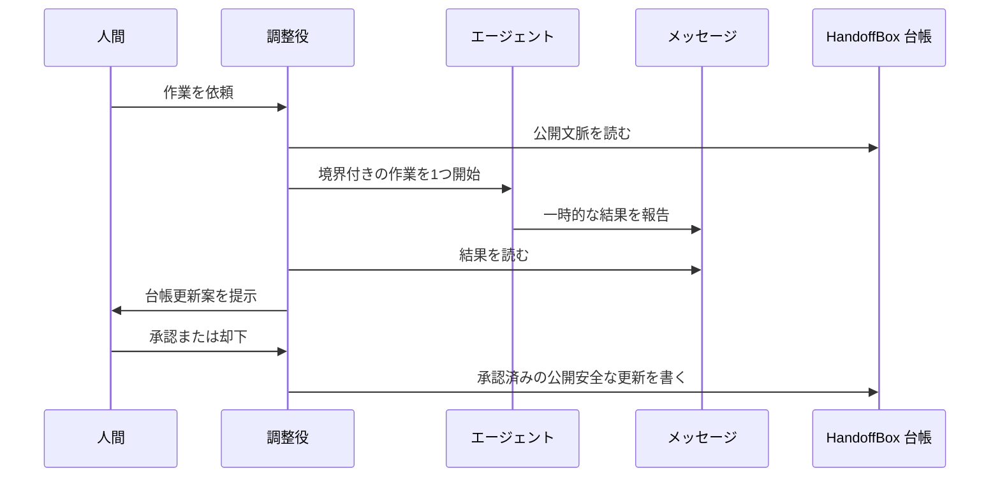

# HandoffBox Relay

[English](./relay.md) | 日本語

HandoffBox Relay は、公開 HandoffBox 台帳を読む AI エージェント同士を連携させる
ための任意の運用モデルです。

台帳が永続的な文脈置き場です。エージェント間メッセージ、AI memory、ローカル
チャットツールは連携には使えますが、公開プロジェクト記録の代わりにはなりません。

## 目的

HandoffBox を公開文脈台帳として使い、短いエージェント間メッセージは一時的な連携
だけに使います。

## 役割

| 構成要素 | 役割 | 担わないこと |
|----------|------|--------------|
| HandoffBox 台帳 | 公開可能なプロジェクト文脈、次の行動、判断 | 非公開ログや秘密情報 |
| 調整役 | 計画、割り当て、要約、承認依頼 | 正本になること |
| エージェント間メッセージ | 短い一時連絡 | 承認、監査記録、機密情報 |
| AI エージェント | 調査、実装、レビュー、検証 | 最終判断 |
| 人間 | 承認と最終判断 | 手作業での文脈再構築 |

## メッセージルール

- 連携メッセージは短くする。
- 公開 Issue 番号、公開リンク、ブランチ名、commit SHA、コマンド要約は、安全に公開
  できる場合だけ含める。
- API キー、トークン、パスワード、秘密情報、個人情報、顧客情報、ローカル環境の
  絶対パスを送らない。
- チャットメッセージだけを作業完了の証拠として扱わない。
- 重要な結果は、公開可能な範囲でプロジェクト台帳、公開 Issue、公開 commit、公開
  PR、公開リリースノートへ昇格させる。
- `DONE`、`BLOCKED`、`NEEDS_APPROVAL` のような明示的な停止信号を優先する。

## 最小ループ

## 最初の実装段階

まずは単一エージェントの試験運用から始めます。

1. 調整役が1つのプロジェクト台帳を読む。
2. 調整役が作業エージェントを1つ起動、または指示する。
3. 作業エージェントが公開安全な短い要約を返す。
4. 調整役が結果を要約する。
5. 公開台帳の更新は、人間が承認してから書き込む。

実装担当 AI は、標準作業手順として
[`Implementation Workflow`](./workflows/implementation-flow.ja.md) を使えます。

## 承認境界

Relay は `AGENTS.md` のルールを変更しません。

機密情報に由来する詳細を公開したり、承認状態を変えたり、提案を承認済みとして扱
ったりするには、人間の承認が必要です。
