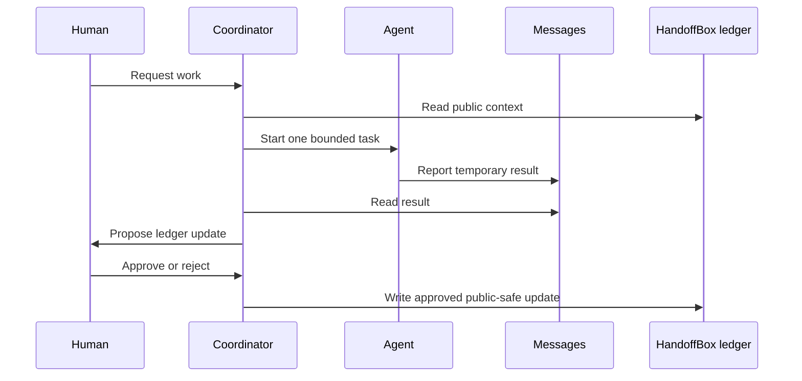

# HandoffBox Relay

English | [日本語](./relay.ja.md)

HandoffBox Relay is an optional coordination model for AI agents that read from
the public HandoffBox ledger.

The ledger remains the durable context surface. Relay messages, AI memory, and
local chat tools can help agents coordinate, but they do not replace public
project records.

## Goal

Use HandoffBox as the public context ledger, and use short agent-to-agent
messages only for temporary coordination.

## Roles

| Component | Responsibility | Not responsible for |
|-----------|----------------|---------------------|
| HandoffBox ledger | Public-safe project context, next actions, decisions | Private logs or secrets |
| Coordinator | Planning, assignment, summarization, approval requests | Being the source of truth |
| Agent messages | Short temporary coordination | Approvals, audit records, sensitive data |
| AI agents | Research, implementation, review, verification | Final authority |
| Human | Approval and final decision | Reconstructing context manually |

## Message Rules

- Keep coordination messages short.
- Include public issue numbers, public links, branch names, commit SHAs, and
  command summaries only when they are safe to expose.
- Do not send API keys, tokens, passwords, private credentials, personal
  information, customer information, or local absolute paths.
- Do not treat a chat message as proof that work is complete.
- Promote important public-safe results to the relevant project ledger file,
  public issue, public commit, public PR, or public release note.
- Prefer explicit stop signals such as `DONE`, `BLOCKED`, or `NEEDS_APPROVAL`.

## Minimal Loop

## First Implementation Stage

Start with a single-agent pilot.

1. The coordinator reads one project ledger.
2. The coordinator starts or instructs one worker agent.
3. The worker reports back with a short public-safe summary.
4. The coordinator summarizes the result.
5. A human approves any public ledger update before it is written.

Builder agents can use the
[`Implementation Workflow`](./workflows/implementation-flow.md) as their
standard work procedure.

## Approval Boundary

Relay does not change the rules in `AGENTS.md`.

Do not publish sensitive-derived details, change approval state, or represent a
proposal as accepted without human approval.
